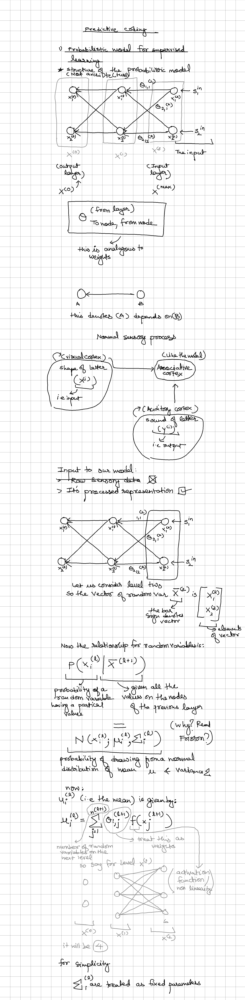
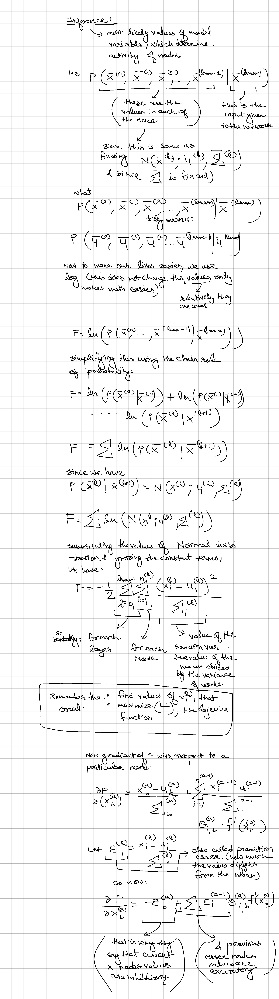
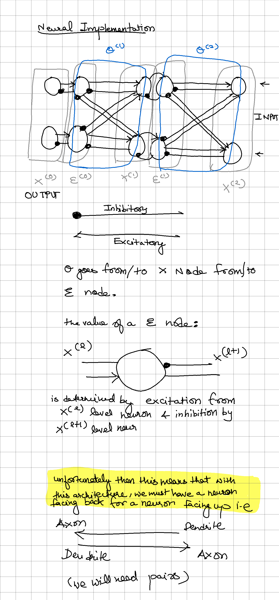
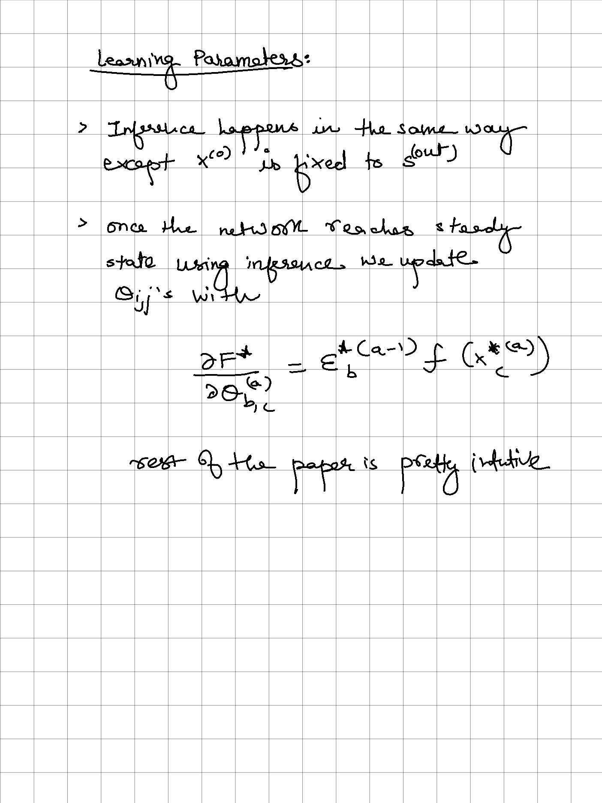

# predictive-coding
Python implementation of An Approximation of the Error Backpropagation Algorithm in a Predictive Coding Network with Local Hebbian Synaptic Plasticity

----
Task list:
- [x] XOR example
- [x] Arbitrary Scalable
- [x] Add ReLU + TanH + Sigmoid activation options
    - [ ] Sigmoid stagnates
- [ ] JAX & GPUs

---
Pred Code Networks are amazing because they don't rely on a Global Loss function, but rather use a bidirectional networks to use local errors that leads to learning.

General Reading on Pred Code Networks: https://arxiv.org/pdf/2107.12979.pdf
 
 Here's in an implementation of a flavour of pred code networks inspired from:
https://www.mrcbndu.ox.ac.uk/sites/default/files/pdf_files/Whittington%20Bogacz%202017_Neural%20Comput.pdf

----
Since I found the paper to be somewhat different and dense, I have attached my notes for now, LaTex soon:

